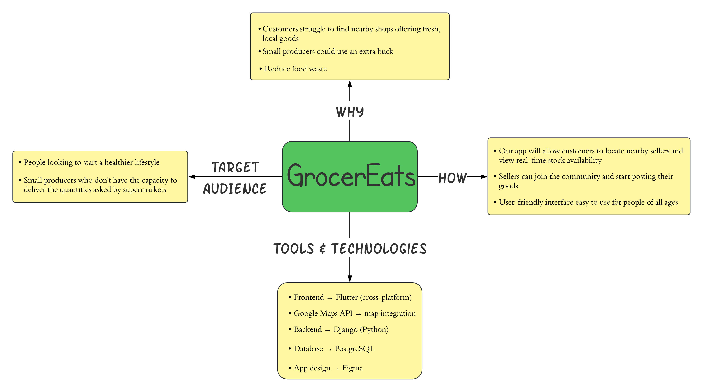

# GrocerEats®

GrocerEats® is a mobile application designed to connect buyers with local producers and shops. Buyers can search for nearby shops, view available stock, and place orders, while sellers can register their shops, manage inventory, and track orders. The app integrates with Google Maps to provide users with a map-based view of nearby shops.

## Table of Contents

1. [Project Overview](#project-overview)
2. [Features](#features)
3. [Architecture](#architecture)
4. [Technologies Used](#technologies-used) 

## Project Overview

GrocerEats® aims to simplify the shopping experience for local buyers by helping them discover shops nearby and providing real-time stock information. Producers can easily enroll their shops, update stock daily, and manage orders through the platform.

## Features

### For Buyers
- **Shop Search**: Search for shops based on location.
- **View Shops on a Map**: Integrated with Google Maps to display nearby shops.
- **Product Details**: View products and stock levels in each shop.
- **Order Management**: Add items to a cart and place orders.
- **Track Orders**: Track the status of orders after placing them.

### For Sellers
- **Shop Registration**: Register a shop and provide location details.
- **Stock Management**: Update stock and product information daily.
- **Order Tracking**: View and manage orders placed by buyers.

### Wireframe

- **Figma project**: https://www.figma.com/design/kEedvA9AiY43oCTQpG6NHZ/Wireframe-GrocerEats?node-id=0-1&node-type=canvas&t=MNCkRTihBmfnCgtm-0

## Architecture

GrocerEats® uses a combination of Monolithic and NLayer architecture:

1. **Presentation Layer (Flutter)**: Handles the mobile app UI for buyers and sellers, as well as Google Maps integration for displaying nearby shops.
2. **Backend (Django)**: Combines the business logic and data access layers. Django handles both:
   - **Business Logic**: Manages all business rules, such as user authentication, shop management, stock updates, and order processing.
   - **Data Access**: Interfaces directly with MongoDB to fetch and store data related to users, shops, inventory, and orders.
3. **Database Layer (MongoDB)**: Stores all core application data, including user accounts, shop details, products, and orders.

<h3 style="text-align: center;">High-Level Architecture Diagram</h3>

  

## Technologies Used

- **Frontend**: [Flutter](https://flutter.dev/)
  - UI for both buyers and sellers
  - Google Maps API integration

- **Backend**: [Django](https://www.djangoproject.com/)
  - Django REST Framework (DRF) for API management

- **Database**: [MongoDB](https://www.mongodb.com/)
  - Stores data for users, shops, products, and orders

- **Other Tools**:
  - **Firebase** for authentication and notifications
  - **Google Maps API** for geolocation and displaying shops on a map
