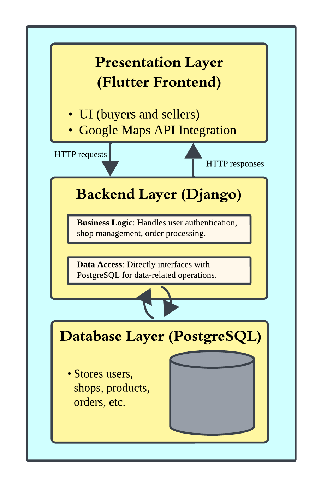

# GrocerEats®

GrocerEats® is a mobile application designed to connect buyers with local producers and shops. Buyers can search for nearby shops, view available stock, and place orders, while sellers can register their shops, manage inventory, and track orders. The app integrates with Google Maps to provide users with a map-based view of nearby shops.

## Table of Contents

1. [Project Overview](#project-overview)
2. [Features](#features)
3. [Architecture](#architecture)
4. [Database Schema](#database-schema)
5. [Technologies Used](#technologies-used)

## Project Overview

GrocerEats® aims to simplify the shopping experience for local buyers by helping them discover shops nearby and providing real-time stock information. Producers can easily enroll their shops, update stock daily, and manage orders through the platform.

## Features

### For Buyers
- **Shop Search**: Search for shops based on location.
- **View Shops on a Map**: Integrated with Google Maps to display nearby shops.
- **Product Details**: View products and stock levels in each shop.
- **Order Management**: Add items to a cart and place orders.
- **Track Orders**: Track the status of orders after placing them.

### For Sellers
- **Shop Registration**: Register a shop and provide location details.
- **Stock Management**: Update stock and product information daily.
- **Order Tracking**: View and manage orders placed by buyers.

### Wireframe

- **Figma project**: [Wireframe-GrocerEats](https://www.figma.com/design/kEedvA9AiY43oCTQpG6NHZ/Wireframe-GrocerEats?node-id=0-1&node-type=canvas&t=MNCkRTihBmfnCgtm-0)

## Architecture

GrocerEats® uses a combination of Monolithic and NLayer architecture:

1. **Presentation Layer (Flutter)**: Handles the mobile app UI for buyers and sellers, as well as Google Maps integration for displaying nearby shops.
2. **Backend (Django)**: Combines the business logic and data access layers. Django handles both:
   - **Business Logic**: Manages all business rules, such as user authentication, shop management, stock updates, and order processing.
   - **Data Access**: Interfaces directly with PostgreSQL to fetch and store data related to users, shops, inventory, and orders.
3. **Database Layer (PostgreSQL)**: Stores all core application data, including user accounts, shop details, products, and orders.

<h3 style="text-align: center;">High-Level Architecture Diagram</h3>

  

## Database Schema

### User
- `id`: Primary key
- `full_name`: String, full name of the user
- `email`: String, unique email for the user
- `phone`: String, contact phone number
- `password`: String, encrypted password
- `role`: Enum (`seller` or `customer`)
- `rating`: Decimal, rating displayed if the user is a seller

### PickupPoint
- `id`: Primary key
- `lat`: Decimal, latitude for geolocation
- `long`: Decimal, longitude for geolocation
- `name`: String, name or description of the pick-up point
- `address`: String, full address of the pick-up point

### Shop
- `id`: Primary key
- `name`: String, name of the shop
- `pickup_point_id`: Foreign key to `PickupPoint`, representing the pick-up location
- `seller_id`: One-to-one relationship with `User`, representing the shop owner (seller)

### Stock
- `id`: Primary key
- `name`: String, name of the stock item (e.g., "Tomatoes")
- `unit`: String, unit of measurement (e.g., "kg", "liters")
- `subcategory_id`: One-to-one relationship with `SubCategory`
- `shop_id`: Foreign key to `Shop`, representing the shop that holds this stock
- `description`: Text, optional description of the stock item
- `photo_url`: String, URL to an image of the stock item
- `quantity`: Decimal, current stock quantity available
- `timestamp_last_modified`: Timestamp, the last modified time for stock updates

### Order
- `id`: Primary key
- `buyer_id`: Foreign key to `User`, representing the buyer
- `shop_id`: Foreign key to `Shop`, representing the shop from which the order was placed
- `total_price`: Decimal, total price for the order
- `status`: Enum (`pending`, `completed`, `cancelled`)
- `timestamp`: Timestamp, time when the order was created

### OrderItem
- `id`: Primary key
- `order_id`: Foreign key to `Order`
- `stock_id`: One-to-one relationship with `Stock`, linking the item to stock in the shop
- `quantity`: Decimal, quantity of the product ordered
- `price_at_purchase`: Decimal, price of the product at the time of purchase

### Category
- `id`: Primary key
- `name`: String, name of the category

### SubCategory
- `id`: Primary key
- `category_id`: Foreign key to `Category`, linking subcategories to a main category
- `name`: String, name of the subcategory
- `description`: Text, optional description of the subcategory

## Technologies Used

- **Frontend**: [Flutter](https://flutter.dev/)
  - UI for both buyers and sellers
  - Google Maps API integration

- **Backend**: [Django](https://www.djangoproject.com/)
  - Django REST Framework (DRF) for API management

- **Database**: [PostgreSQL](https://www.postgresql.org/)
  - Stores data for users, shops, products, and orders

- **Other Tools**:
  - **Google Maps API** for geolocation and displaying shops on a map
